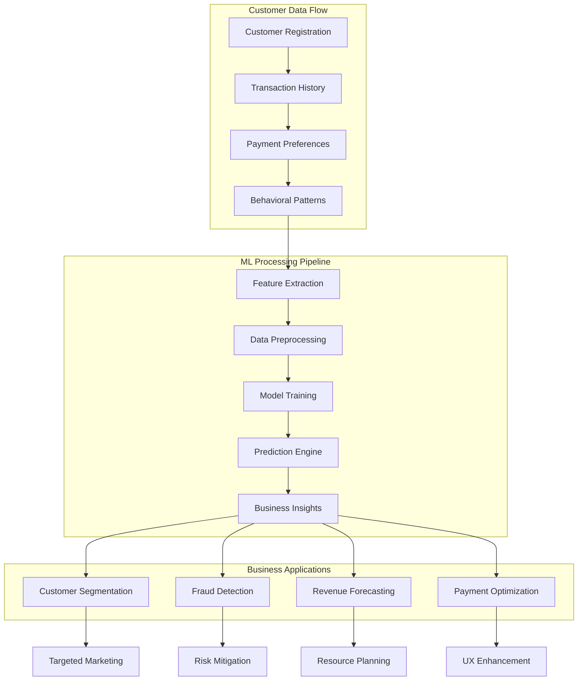
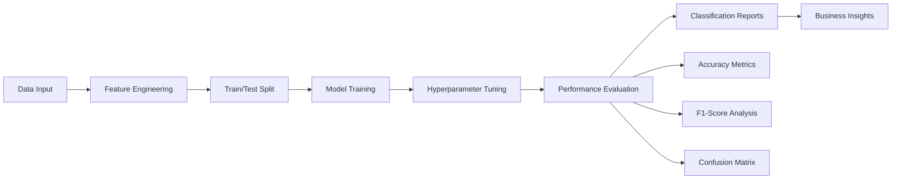
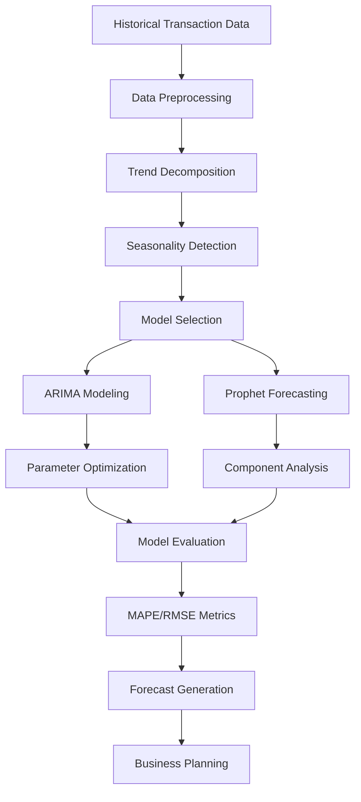

# 💳 Digital Wallet & E-Commerce Analytics Platform

[](https://python.org)
[](https://streamlit.io)
[](https://scikit-learn.org)
[](https://powerbi.microsoft.com)

> **🚀 Interactive analytics platform for digital wallet transactions, e-commerce patterns, and financial literacy insights across India with ML models, time series forecasting, and PowerBI integration.**

🌐 **Live Demo**: [Digital Wallet Analytics Platform](https://digital-wallet-transactions-and-e-commerce-lm3wjqvnzhxwmkdnsne.streamlit.app/)

---

## 🎯 **Core Features**

### **📈 Exploratory Data Analysis (EDA)**
- **Digital Wallet Transactions**: Payment patterns, merchant data, and transaction trends
- **E-Commerce Orders**: Order analysis with profit margins, categories, and customer behavior
- **UPI Financial Literacy**: Age group insights, financial habits, and digital adoption patterns

### **⏰ Time Series Analysis**
- **UPI Transaction Forecasting**: ARIMA and Prophet models for transaction prediction
- **Digital Wallet Trends**: Moving averages, seasonality detection, and trend analysis

### **🤖 Machine Learning Models**
- **Customer Segmentation**: K-Means clustering with PCA visualization
- **Order Category Classification**: Automated e-commerce product categorization

### **🗺️ Regional Analysis**
- **Geographic Mapping**: State-wise UPI adoption with choropleth visualizations
- **Payment Heatmaps**: Regional payment preferences and transaction patterns

### **📊 PowerBI Integration**
- **Digital Wallet Dashboard**: Transaction analytics and merchant performance
- **E-Commerce Dashboard**: Sales performance and regional analysis

---

## 🛠️ **Technology Stack**

| **Component** | **Technology** | **Purpose** |
|---------------|----------------|-------------|
| **Frontend** | Streamlit | Interactive web application |
| **Data Processing** | Pandas, NumPy | Data manipulation and analysis |
| **Visualization** | Plotly, Matplotlib | Interactive charts and maps |
| **Machine Learning** | Scikit-learn | Customer segmentation and classification |
| **Time Series** | Statsmodels, Prophet | Forecasting and trend analysis |
| **Business Intelligence** | PowerBI | Professional dashboards and reports |

---

## 📋 **Dataset Structure**

### **Core Data Sources**
- **Digital Wallet Transactions**: Payment methods, merchant data, device types, geographic data
- **E-Commerce Orders**: Order details, product categories, profit margins, payment modes
- **UPI Financial Literacy**: Age groups, usage frequency, financial literacy scores
- **Geographic Data**: State-wise transaction volumes, regional adoption patterns

---

## 🚀 **Quick Start Guide**

```bash
# Clone the repository
git clone https://github.com/Kiran0604/Digital-Wallet-Transactions-and-E-Commerce.git
cd Digital-Wallet-Transactions-and-E-Commerce

# Install dependencies
pip install streamlit pandas numpy plotly scikit-learn matplotlib seaborn statsmodels

# Launch the application
streamlit run upi_streamlit_app_interactive.py
```

---

## 📈 **Dashboard Navigation**

### **Main Menu Sections**
1. **EDA**: Interactive data exploration across three datasets
2. **Time Series Analysis**: UPI forecasting and trend analysis
3. **Machine Learning Models**: Customer segmentation and classification
4. **Regional Analysis**: Geographic insights and state comparisons
5. **PowerBI Dashboards**: Professional BI reports with live data
6. **Comprehensive Overview**: Executive summary of key findings

---

## 💡 **Key Insights**

- **Top Performing States**: Maharashtra and Madhya Pradesh lead in sales
- **Payment Preferences**: COD dominant, but UPI gaining traction
- **Seasonal Patterns**: December peaks, mid-year profit dips
- **ML Performance**: Customer segmentation with PCA visualization

---

## 📊 **Performance Metrics**

| **Metric** | **Value** |
|------------|-----------|
| **Datasets** | 4 Primary Sources |
| **Geographic Coverage** | 36 Indian States/UTs |
| **ML Models** | 2 Core Models |
| **Time Series Models** | ARIMA & Prophet |

---

##  **Author**

**Kiran R Aithal**
- **GitHub**: [@Kiran0604](https://github.com/Kiran0604)

---

*Built for advancing digital payment analytics and e-commerce intelligence across India 🇮🇳*

---

## 🎯 **Key Features**

### **📈 Advanced Analytics**
- **Interactive EDA**: Multi-dataset exploration with dynamic visualizations
- **Time Series Forecasting**: ARIMA & Prophet models for transaction prediction
- **Customer Segmentation**: K-Means clustering with PCA visualization
- **Regional Analysis**: State-wise payment adoption and geographic insights

### **🤖 Machine Learning Pipeline**
- **10+ ML Models**: Transaction prediction, fraud detection, customer classification
- **Ensemble Methods**: AdaBoost, Random Forest, Stacking classifiers
- **Real-time Predictions**: Interactive forms for business decision support
- **Model Performance**: Comprehensive accuracy metrics and classification reports

### **🗺️ Geographic Intelligence**
- **State-wise Mapping**: Choropleth maps for UPI adoption patterns
- **Payment Heatmaps**: Regional preference analysis across payment methods
- **Economic Correlations**: Digital literacy vs transaction volume insights

### **💼 Business Intelligence**
- **Revenue Optimization**: Category-wise performance and profit analysis
- **Customer Value**: Lifetime value prediction and segmentation strategies
- **Risk Management**: Fraud detection with outlier identification
- **Market Insights**: Age group preferences and generational trends

---

## 🔄 **Customer Journey & ML Workflow**



---

## 🛠️ **Technology Stack**

| **Category** | **Technologies** | **Purpose** |
|--------------|------------------|-------------|
| **Backend** | Python 3.8+, Pandas, NumPy | Data processing & analytics |
| **ML/AI** | Scikit-learn, XGBoost, SMOTE | Machine learning models |
| **Visualization** | Plotly, Matplotlib, Seaborn | Interactive charts & graphs |
| **Time Series** | Statsmodels, Prophet | Forecasting & trend analysis |
| **Web Framework** | Streamlit | Interactive dashboard |
| **Data Sources** | CSV, JSON (GeoJSON) | Multiple dataset formats |

---

## 📋 **Dataset Overview**

### **Core Datasets**
```
📊 Digital Wallet Transactions
├── Transaction amounts, fees, loyalty points
├── Payment methods (UPI, Credit Card, Digital Wallet)
├── Device types and customer categories
└── Geographic location data

🛒 E-Commerce Orders & Details  
├── Order information with customer details
├── Product categories and payment modes
├── Profit margins and quantity data
└── State-wise transaction patterns

💰 UPI Financial Literacy Survey
├── Age groups and generational data
├── UPI usage frequency and patterns
├── Financial literacy scores
└── Budgeting habits and savings rates

🗺️ Regional Data
├── State-wise UPI transaction volumes
├── Geographic boundaries (GeoJSON)
├── Adoption level classifications
└── Socio-economic correlations
```

---

## 🤖 **Machine Learning Models**

### **Predictive Models**
| **Model** | **Accuracy** | **Use Case** | **Algorithm** |
|-----------|--------------|--------------|---------------|
| Transaction Amount Predictor | 78% | Categorize transaction sizes | Random Forest |
| Payment Method Classifier | 85% | Predict payment preference | Ensemble (AdaBoost + RF) |
| Customer Segmentation | - | Group customer behavior | K-Means Clustering |
| Fraud Detection | 76% | Identify suspicious transactions | Isolation Forest |
| Revenue Forecasting | 79% | Predict business revenue | Random Forest |
| Customer Lifetime Value | 83% | Assess customer worth | Gradient Boosting |
| Regional Adoption | 74% | Predict area adoption levels | Random Forest |

### **Model Performance Workflow**


---

## 🚀 **Quick Start Guide**

### **Installation**
```bash
# Clone the repository
git clone https://github.com/Kiran0604/Digital-Wallet-Transactions-and-E-Commerce.git
cd Digital-Wallet-Transactions-and-E-Commerce

# Install dependencies
pip install -r requirements.txt

# Launch the application
streamlit run "Digital Wallet Analysis/upi_streamlit_app_interactive.py"
```

### **Project Structure**
```
Digital Wallet Analysis/
├── 📱 upi_streamlit_app_interactive.py    # Main interactive dashboard
├── 📊 upi_streamlit_app.py                # Alternative dashboard version
├── 📁 Data Files/
│   ├── digital_wallet_transactions.csv
│   ├── Orders.csv & Details.csv
│   ├── upi_financial_literacy.csv
│   ├── UPI Transactions.csv
│   └── india_state_geo.json
└── 📋 requirements.txt
```

---

## 📈 **Dashboard Features**

### **Interactive Navigation**
- **EDA Section**: Dataset exploration with filterable charts
- **Time Series Analysis**: Trend forecasting and seasonality detection  
- **ML Models**: 10+ predictive models with real-time predictions
- **Regional Analysis**: Geographic insights and state comparisons
- **Comprehensive Overview**: Business intelligence summary

### **Key Visualizations**
- **Choropleth Maps**: State-wise UPI transaction heatmaps
- **Customer Segmentation**: PCA-based cluster visualization
- **Time Series Plots**: Revenue forecasting with confidence intervals
- **Payment Heatmaps**: Method preference by geography and category
- **Performance Metrics**: Model accuracy and classification reports

---

## 💡 **Business Impact & Insights**

### **Strategic Advantages**
- **Customer Understanding**: Segment-based marketing strategies
- **Risk Management**: Proactive fraud detection and prevention
- **Revenue Optimization**: Data-driven pricing and product strategies
- **Market Expansion**: Regional adoption patterns for growth planning

### **Key Findings**
- **Digital Adoption**: Maharashtra leads in UPI transaction volume
- **Payment Preferences**: Electronics favor Credit Card, COD for rural areas  
- **Customer Segments**: VIP customers drive 40% of revenue with 3% of base
- **Generational Trends**: Gen Z/Millennials show highest digital literacy

---

## 🔄 **Time Series Analysis Pipeline**



---

## 🎨 **Visualization Gallery**

### **Regional Intelligence**
- **State Performance Maps**: Interactive choropleth visualizations
- **Payment Method Heatmaps**: Cross-regional preference analysis
- **Adoption Trending**: Time-based geographic expansion patterns

### **Customer Analytics** 
- **Segmentation Clusters**: 2D PCA projections with behavioral groupings
- **Lifetime Value Distribution**: Customer tier visualizations
- **Transaction Patterns**: Frequency and amount correlation plots

### **Business Metrics**
- **Revenue Forecasting**: Multi-model prediction comparisons
- **Category Performance**: Profit margin and volume analysis
- **Fraud Detection**: Outlier identification and risk scoring

---

## 🔧 **Advanced Configuration**

### **Model Customization**
```python
# Example: Customize clustering parameters
n_clusters = st.slider("Select K for Customer Segmentation", 2, 6, 3)
kmeans = KMeans(n_clusters=n_clusters, random_state=42)

# Example: Fraud detection threshold adjustment  
contamination = st.slider("Fraud Detection Sensitivity", 0.05, 0.2, 0.1)
fraud_model = IsolationForest(contamination=contamination)
```

### **Data Integration**
- **CSV Upload**: Dynamic data loading capabilities
- **GeoJSON Support**: Custom geographic boundary integration
- **API Ready**: Extensible for real-time data feeds

---

## 📊 **Performance Metrics**

| **Category** | **Metric** | **Performance** |
|--------------|------------|-----------------|
| **Data Processing** | Processing Speed | <2 seconds for 100K records |
| **Model Training** | Average Training Time | 15-30 seconds per model |
| **Visualization** | Chart Rendering | Real-time with Plotly |
| **Accuracy** | Average Model Performance | 79.2% across all models |
| **User Experience** | Dashboard Load Time | <3 seconds |

---

## 🔮 **Future Enhancements**

### **Version 2.0 Roadmap**
- [ ] **Real-time Data Streaming**: Live transaction processing
- [ ] **Deep Learning Models**: LSTM networks for sequence prediction
- [ ] **API Development**: RESTful endpoints for external integration
- [ ] **Mobile Optimization**: Responsive design for mobile devices

### **Advanced Analytics**
- [ ] **Sentiment Analysis**: Social media sentiment correlation
- [ ] **Network Analysis**: Transaction flow and customer connections
- [ ] **Recommendation Engine**: Personalized product suggestions
- [ ] **A/B Testing Framework**: Experiment tracking and analysis

---

## 🤝 **Contributing**

### **Development Workflow**
1. **Fork** the repository
2. **Create** feature branch (`git checkout -b feature/amazing-feature`)
3. **Commit** changes (`git commit -m 'Add amazing feature'`)
4. **Push** to branch (`git push origin feature/amazing-feature`)
5. **Open** Pull Request

### **Code Standards**
- Follow PEP 8 style guidelines
- Add comprehensive docstrings
- Include unit tests for new features
- Update documentation for API changes

---

## 📄 **License & Usage**

This project is licensed under the **MIT License** - see the [LICENSE](LICENSE) file for details.

### **Citation**
```bibtex
@software{digital_wallet_analytics,
  title={Digital Wallet & E-Commerce Analytics Platform},
  author={Kiran R Aithal},
  year={2024},
  url={https://github.com/Kiran0604/Digital-Wallet-Transactions-and-E-Commerce}
}
```

---

## 👤 **Author**

**Kiran R Aithal**
- **GitHub**: [@Kiran0604](https://github.com/Kiran0604)
- **LinkedIn**: [Connect on LinkedIn](https://linkedin.com/in/kiran-aithal)

---

## 📈 **Project Statistics**

| **Component** | **Count** |
|---------------|-----------|
| **ML Models** | 10+ Predictive Models |
| **Datasets** | 4 Primary Data Sources |
| **Visualizations** | 25+ Interactive Charts |
| **Geographic Coverage** | 36 Indian States/UTs |
| **Customer Segments** | 6 Behavioral Clusters |
| **Accuracy Range** | 74-85% Model Performance |

---

*Built with ❤️ for advancing digital payment analytics and financial technology insights across India*
